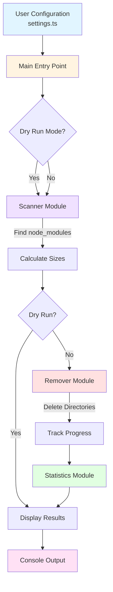
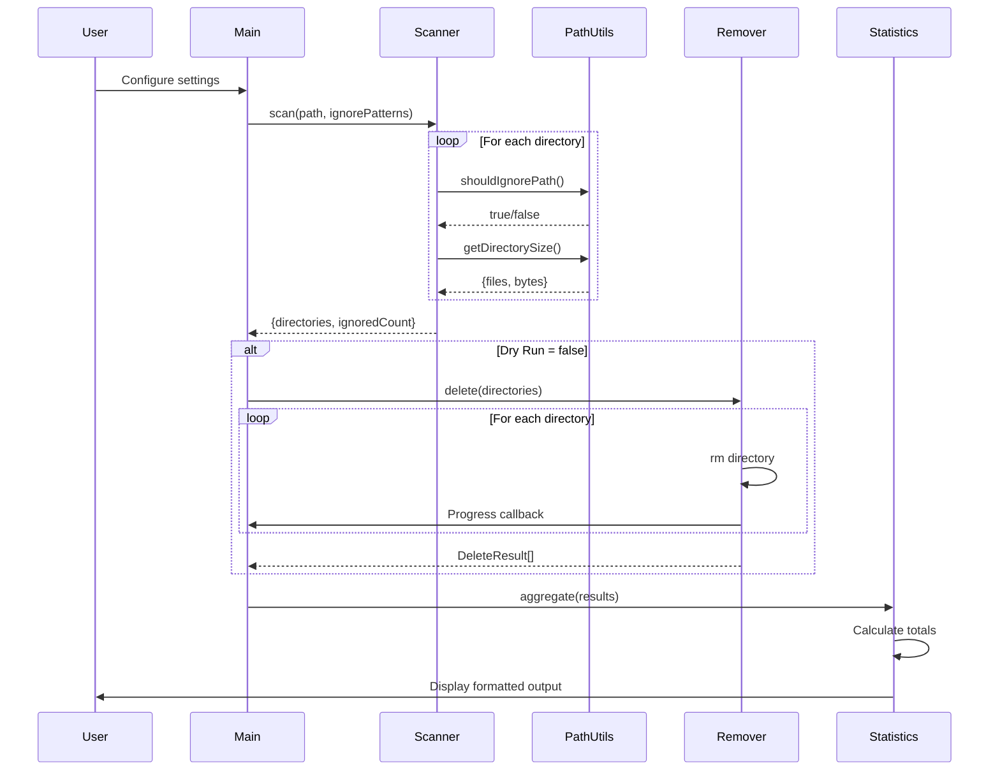

# Node Modules Remover

A powerful TypeScript CLI tool that recursively scans directories to find and delete node_modules folders, with intelligent path filtering, real-time progress updates, and comprehensive statistics reporting.

Built in March 2026. This CLI utility traverses directory trees, identifies node_modules folders, removes them efficiently, and provides detailed logs, progress feedback, and summary statistics for safe, automated cleanup.

## 🎯 Why Node Modules Remover?

Are you tired of `node_modules` directories consuming gigabytes of disk space across your projects? This tool helps you:

- **Reclaim Disk Space** - Free up gigabytes by removing unused dependencies
- **Clean Efficiently** - Process hundreds of directories in minutes
- **Stay Safe** - Dry-run mode prevents accidental deletions
- **See Progress** - Real-time updates show exactly what's happening
- **Filter Smartly** - Protect important projects with ignore patterns

## ✨ Features

- 🔍 **Recursive Scanning**: Finds all `node_modules` directories at any depth
- 📡 **Live Scan Progress**: Real-time display of current path being scanned and directories found (updates every 500ms)
- 🛡️ **Dry-Run Mode**: Preview what will be deleted before actual removal (enabled by default)
- 🎯 **Smart Filtering**: Ignore specific paths by pattern matching
- 📊 **Detailed Statistics**: Shows directories, files, total size, and ignored paths
- ⏱️ **Live Delete Progress**: Real-time progress display during deletion (updates every 2 seconds)
- ⚡ **Fast & Efficient**: Parallel processing for optimal performance
- 🔒 **Type-Safe**: Written in TypeScript with full type safety

## 📊 Architecture

### System Flow



### Module Interaction

```mermaid
graph LR
    A[Scanner] -->|ScanResult[]| B[Statistics]
    C[Remover] -->|DeleteResult[]| B
    B -->|Display| D[Console]
    E[PathUtils] -.->|Filter| A
    E -.->|Size| A
    F[FormatUtils] -.->|Format| B

    style A fill:#bbdefb
    style C fill:#ffccbc
    style B fill:#c5e1a5
    style D fill:#fff59d
    style E fill:#e1bee7
    style F fill:#ffccbc
```

### Data Flow



## 🚀 Installation

```bash
# Clone the repository
git clone <repository-url>
cd node-modules-remover

# Install dependencies
pnpm install

# Build the project
pnpm build
```

## Configuration

Edit `src/settings.ts` to configure the tool:

```typescript
export const settings: Settings = {
  scanPath: '/Users/yourusername/Repos', // Root directory to scan
  ignorePaths: [], // Patterns to ignore (e.g., ['Project A', 'my-app'])
  dryRun: true, // Set to false to actually delete
};
```

### Configuration Options

- **scanPath**: The root directory to start scanning from
- **ignorePaths**: Array of strings - if any path contains these strings (case-insensitive), it will be skipped along with all subdirectories
- **dryRun**: When `true`, shows what would be deleted without actually deleting anything. Set to `false` to perform actual deletion.

### Example Ignore Patterns

```typescript
export const settings: Settings = {
  scanPath: '/Users/orassayag/Repos',
  ignorePaths: ['important-project', 'production', '.backup'],
  dryRun: true,
};
```

This configuration will skip any path containing "important-project", "production", or ".backup".

## 📖 Usage

### Dry-Run Mode (Preview Only)

By default, the tool runs in dry-run mode and will NOT delete anything:

```bash
pnpm start
```

**Output Example:**

```
🔍 Node Modules Remover

[DRY RUN MODE] No files will be deleted

Scanning: /Users/orassayag/Repos

Scanning directories...

Scanning: 58 found | Current: /Users/orassayag/Repos/my-project/src/components

(Scanning line updates in-place showing current path and count...)

Found 58 node_modules directories

[DRY RUN] No files were deleted

===DIRECTORIES: 58===
===FILES: 84,543,554===
===SIZE: 5.67GB (6,089,740,000 bytes)===
===IGNORED: 0===

✅ Done!
```

### Actual Deletion

To actually delete the `node_modules` directories:

1. Edit `src/settings.ts` and set `dryRun: false`
2. Run the tool:

```bash
pnpm start
```

**Output Example with Live Progress:**

```
🔍 Node Modules Remover

Scanning: /Users/orassayag/Repos

Scanning directories...

Scanning: 58 found | Current: /Users/orassayag/Repos/archived/old-project/lib

(Scanning line updates every 500ms...)

Found 58 node_modules directories

🗑️  Deleting node_modules directories...

Progress: 35/58 (60%) | Deleted: 35 | Size: 4.12GB | Files: 48,234,123

(Progress line updates in-place every 2 seconds...)

✅ Deleted 58/58 directories successfully

===DIRECTORIES: 58===
===FILES: 84,543,554===
===SIZE: 5.67GB (6,089,740,000 bytes)===
===IGNORED: 0===
===DELETED: 58===

✅ Done!
```

## 🛠️ Development

### Available Scripts

```bash
# Run the tool
pnpm start

# Run tests
pnpm test

# Run tests in watch mode
pnpm test:watch

# Build the project
pnpm build

# Lint the code
pnpm lint

# Fix linting issues
pnpm lint:fix

# Check code formatting
pnpm prettier

# Fix formatting issues
pnpm prettier:fix
```

### Running Tests

```bash
pnpm test
```

All tests are located in `__tests__` directories next to the source files they test.

### Project Structure

```
node-modules-remover/
├── src/
│   ├── main.ts                    # Entry point
│   ├── settings.ts                # Configuration
│   ├── types/
│   │   └── index.ts              # Type definitions
│   ├── core/
│   │   ├── scanner.ts            # Directory scanning logic
│   │   ├── remover.ts            # Deletion logic
│   │   ├── statistics.ts         # Stats collection & display
│   │   └── __tests__/            # Core module tests
│   └── utils/
│       ├── pathUtils.ts          # Path utilities
│       ├── formatUtils.ts        # Formatting utilities
│       └── __tests__/            # Utils tests
├── package.json
├── tsconfig.json
└── README.md
```

## ⚙️ How It Works

1. **Scanner** recursively traverses the directory tree starting from `scanPath`
   - Shows live progress: current path being scanned and count of `node_modules` found
   - Updates every 500ms for responsive feedback
2. **Filtering** checks each path against `ignorePaths` patterns and skips matches
3. **Size Calculation** computes the total files and bytes for each `node_modules` directory
4. **Deletion** (if not dry-run) safely removes each directory with error handling
   - Shows live progress: percentage, deleted count, size, and file count
   - Updates every 2 seconds during deletion
5. **Statistics** aggregates and displays final formatted results

## 🛡️ Safety Features

- ✅ **Dry-run mode enabled by default** - prevents accidental deletions
- ✅ **Path filtering** - protect important directories
- ✅ **Error handling** - continues processing even if some deletions fail
- ✅ **Detailed logging** - see exactly what's being processed

## 📚 Example Scenarios

### Scenario 1: Preview Before Deleting

```typescript
// settings.ts
export const settings: Settings = {
  scanPath: '/Users/orassayag/Repos',
  ignorePaths: [],
  dryRun: true, // Safe preview mode
};
```

Run `pnpm start` to see what would be deleted.

### Scenario 2: Delete Everything Except Specific Projects

```typescript
// settings.ts
export const settings: Settings = {
  scanPath: '/Users/orassayag/Repos',
  ignorePaths: ['production-app', 'client-project'],
  dryRun: false, // Actually delete
};
```

This will delete all `node_modules` except in paths containing "production-app" or "client-project".

### Scenario 3: Clean a Specific Subdirectory

```typescript
// settings.ts
export const settings: Settings = {
  scanPath: '/Users/orassayag/Repos/archived-projects',
  ignorePaths: [],
  dryRun: false,
};
```

## ⚡ Performance

The tool uses:

- **Async/await** with `fs.promises` for non-blocking I/O
- **Parallel processing** for size calculations
- **Early exit optimization** when paths are ignored

Typical performance: ~50-100 directories per minute depending on disk speed and directory depth.

## 🔧 Troubleshooting

### Permission Errors

If you encounter permission errors:

- Ensure you have read/write access to the directories
- On macOS/Linux, you may need to adjust folder permissions
- Run with appropriate user privileges

### Out of Memory

If scanning very large directory trees:

- Consider scanning smaller subdirectories separately
- The tool streams results to avoid loading everything into memory

## 📄 License

This project is licensed under the MIT License - see the [LICENSE](LICENSE) file for details.

## 🤝 Contributing

Contributions are welcome! Please read our [Contributing Guide](CONTRIBUTING.md) for details on our code of conduct and the process for submitting pull requests.

### Quick Start for Contributors

1. Fork the repository
2. Create your feature branch (`git checkout -b feature/AmazingFeature`)
3. Commit your changes (`git commit -m 'feat: add some amazing feature'`)
4. Push to the branch (`git push origin feature/AmazingFeature`)
5. Open a Pull Request

See [CONTRIBUTING.md](CONTRIBUTING.md) for detailed guidelines.

## 📚 Documentation

- [Contributing Guide](CONTRIBUTING.md) - How to contribute to this project
- [Developer Instructions](INSTRUCTIONS.md) - Detailed development documentation
- [License](LICENSE) - MIT License details

## 🙏 Acknowledgments

- Built with [TypeScript](https://www.typescriptlang.org/)
- Tested with [Vitest](https://vitest.dev/)
- Package management by [pnpm](https://pnpm.io/)

## 📧 Contact

Or Assayag - [@orassayag](https://github.com/orassayag)

Project Link: [https://github.com/orassayag/node-modules-remover](https://github.com/orassayag/node-modules-remover)

## ⭐ Show Your Support

Give a ⭐️ if this project helped you reclaim your disk space!

---

**⚠️ Warning**: This tool permanently deletes directories. Always run in dry-run mode first and double-check your ignore patterns before setting `dryRun: false`.

## License

This application has an MIT license - see the [LICENSE](LICENSE) file for details.
